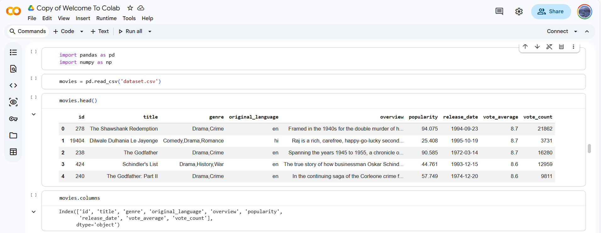
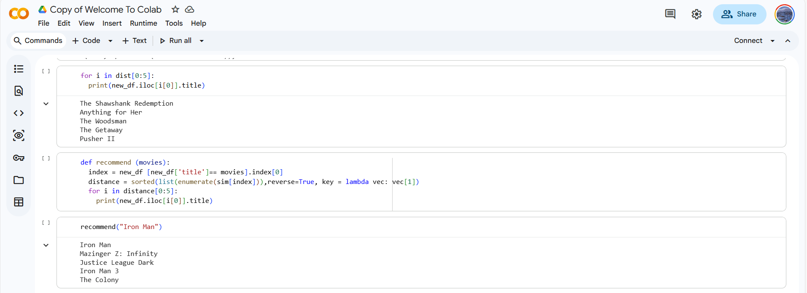

# 🎬 Movie Recommendation System using Machine Learning

This project implements a **content-based movie recommendation system** that recommends similar movies based on textual information such as genres and movie descriptions. The system uses **NLP techniques, TF features, and cosine similarity** to generate recommendations.

## 🚀 Project Overview

The goal of this system is to recommend movies that are similar to a selected movie from a dataset. This is achieved using:

- **Text Preprocessing** – Cleaning and preparing the movie text data  
- **Feature Vectorization** – Using **CountVectorizer** to convert text into numeric features  
- **Similarity Computation** – Calculating **Cosine Similarity** between movies  
- **Ranking & Recommendation** – Sorting movies based on similarity distance

## 📁 Dataset

The dataset contains 10,000 movies with the following attributes:

| Column              | Description                          |
|---------------------|--------------------------------------|
| `id`                | Unique movie identifier              |
| `title`             | Movie title                          |
| `genre`             | List of genres                       |
| `overview`          | Movie plot description               |
| `popularity`        | Popularity score                     |
| `vote_average`      | Rating                               |
| `vote_count`        | Number of votes                      |
| `release_date`      | Release year                         |
| `original_language` | Language code                        |

📥 Click the link below to download the CSV file:  
[Download dataset.csv](./dataset.csv)

## 🧩 System Components

| Component           | Description                                          |
|---------------------|------------------------------------------------------|
| **Vectorizer**      | Extracts key tokens and features from movie text     |
| **Similarity Engine** | Computes pairwise similarity between movies        |
| **Ranking Module**  | Sorts movies based on similarity scores              |
| **Inference**       | Returns final recommended movie suggestions          |

## 📦 Tech Stack

- **Python** – Programming language  
- **Pandas** – Data manipulation and analysis  
- **NumPy** – Numerical computations  
- **Scikit-Learn** – Machine learning and feature extraction  
- **NLP (Bag-of-Words)** – Text vectorization  
- **Cosine Similarity** – Computing similarity between vectors  

## 🧪 Results

The system successfully recommends movies with **similar themes, genres, and narrative structures**.

  



## 🎯 Full Code + Outputs + Line-by-Line Comments

```python
import pandas as pd
import numpy as np

# Load dataset
movies = pd.read_csv('dataset.csv')

# ────────────────────────────────────────────────
# 1. Explore the data
# ────────────────────────────────────────────────

movies.head()
# Output:
#    id                          title                   genre original_language                                           overview  popularity release_date  vote_average  vote_count
# 0   278     The Shawshank Redemption              Drama,Crime                en  Framed in the 1940s for the double murder of h...      94.075   1994-09-23           8.7       21862
# 1 19404  Dilwale Dulhania Le Jayenge     Comedy,Drama,Romance                hi  Raj is a rich, carefree, happy-go-lucky second...      25.408   1995-10-19           8.7        3731
# 2   238                 The Godfather              Drama,Crime                en  Spanning the years 1945 to 1955, a chronicle o...      90.585   1972-03-14           8.7       16280
# 3   424             Schindler's List        Drama,History,War                en  The true story of how businessman Oskar Schind...      44.761   1993-12-15           8.6       12959
# 4   240        The Godfather: Part II              Drama,Crime                en  In the continuing saga of the Corleone crime f...      57.749   1974-12-20           8.6        9811

movies.columns
# Output:
# Index(['id', 'title', 'genre', 'original_language', 'overview', 'popularity',
#        'release_date', 'vote_average', 'vote_count'],
#       dtype='object')

movies.info()
# Output:
# <class 'pandas.core.frame.DataFrame'>
# RangeIndex: 10000 entries, 0 to 9999
# Data columns (total 9 columns):
#  #   Column             Non-Null Count  Dtype  
# ---  ------             --------------  -----  
#  0   id                 10000 non-null  int64  
#  1   title              10000 non-null  object 
#  2   genre              9997 non-null   object 
#  3   original_language  10000 non-null  object 
#  4   overview           9987 non-null   object 
#  5   popularity         10000 non-null  float64
#  6   release_date       10000 non-null  object 
#  7   vote_average       10000 non-null  float64
#  8   vote_count         10000 non-null  int64  
# dtypes: float64(2), int64(2), object(5)
# memory usage: 703.3+ KB

# ────────────────────────────────────────────────
# 2. Create tags (very basic concatenation)
# ────────────────────────────────────────────────

movies['tags'] = movies['genre'] + movies['overview']

movies.head()
# Output: (shows tags column added at the end)

# ────────────────────────────────────────────────
# 3. Create working dataframe
# ────────────────────────────────────────────────

new_df = movies[['id','title','genre','overview','tags']]

new_df.head()
# Output: (still has genre & overview)

new_df = new_df.drop(columns=['genre','overview'])

new_df.head()
# Output:
#    id                          title                                              tags
# 0   278     The Shawshank Redemption              Drama,CrimeFramed in the 1940s for the double ...
# 1 19404  Dilwale Dulhania Le Jayenge     Comedy,Drama,RomanceRaj is a rich, carefree, h...
# 2   238                 The Godfather              Drama,CrimeSpanning the years 1945 to 1955, a ...
# 3   424             Schindler's List        Drama,History,WarThe true story of how busines...
# 4   240        The Godfather: Part II              Drama,CrimeIn the continuing saga of the Corle...

# ────────────────────────────────────────────────
# 4. Vectorization
# ────────────────────────────────────────────────

from sklearn.feature_extraction.text import CountVectorizer

cv = CountVectorizer(max_features=10000, stop_words='english')

cv
# Output:
# CountVectorizer(max_features=10000, stop_words='english')

# Safe version with fillna (recommended)
import pandas as pd
from sklearn.feature_extraction.text import CountVectorizer

if 'movies' not in locals():
    movies = pd.read_csv('dataset.csv')

if 'tags' not in movies.columns:
    movies['tags'] = movies['genre'].fillna('') + movies['overview'].fillna('')

new_df = movies[['id','title','tags']]

cv = CountVectorizer(max_features=10000, stop_words='english')

vec = cv.fit_transform(new_df['tags'].values.astype('U')).toarray()

vec
# Output (sample – sparse matrix shown as dense array):
# array([[0, 0, 0, ..., 0, 0, 0],
#        [0, 0, 0, ..., 0, 0, 0],
#        [0, 0, 0, ..., 0, 0, 0],
#        ...,
#        [0, 0, 0, ..., 0, 0, 0],
#        [0, 0, 0, ..., 0, 0, 0],
#        [0, 0, 0, ..., 0, 0, 0]])

vec.shape
# Output: (10000, 10000)

# ────────────────────────────────────────────────
# 5. Compute similarity matrix
# ────────────────────────────────────────────────

from sklearn.metrics.pairwise import cosine_similarity

sim = cosine_similarity(vec)

sim
# Output (sample):
# array([[1.        , 0.06253054, 0.05802589, ..., 0.07963978, 0.07597372,
#         0.03798686],
#        [0.06253054, 1.        , 0.08980265, ..., 0.        , 0.        ,
#         0.        ],
#        [0.05802589, 0.08980265, 1.        , ..., 0.02541643, 0.03636965,
#         0.        ],
#        ...,
#        [0.07963978, 0.        , 0.02541643, ..., 1.        , 0.03327792,
#         0.03327792],
#        [0.07597372, 0.        , 0.03636965, ..., 0.03327792, 1.        ,
#         0.04761905],
#        [0.03798686, 0.        , 0.        , ..., 0.03327792, 0.04761905,
#         1.        ]])

# ────────────────────────────────────────────────
# 6. Test similarity sorting (example with Shawshank)
# ────────────────────────────────────────────────

new_df[new_df['title']=='The Shawshank Redemption']
# Output:
#    id                          title                                              tags
# 0   278     The Shawshank Redemption              Drama,CrimeFramed in the 1940s for the double ...

dist = sorted(list(enumerate(sim[0])), reverse=True, key=lambda vec: vec[1])

dist
# Output (top portion shown):
# [(0, np.float64(1.0000000000000002)),
#  (3709, np.float64(0.23539595453459988)),
#  (3649, np.float64(0.22019275302527214)),
#  (9006, np.float64(0.20751433915982243)),
#  ... ]

for i in dist[0:5]:
    print(new_df.iloc[i[0]].title)
# Output:
# The Shawshank Redemption
# Anything for Her
# The Woodsman
# The Getaway
# Pusher II

# ────────────────────────────────────────────────
# 7. Recommendation function
# ────────────────────────────────────────────────

def recommend(movies):
    index = new_df[new_df['title'] == movies].index[0]
    distance = sorted(list(enumerate(sim[index])), reverse=True, key=lambda vec: vec[1])
    for i in distance[0:5]:
        print(new_df.iloc[i[0]].title)

recommend("Iron Man")
# Output:
# Iron Man
# Mazinger Z: Infinity
# Justice League Dark
# Iron Man 3
# The Colony
